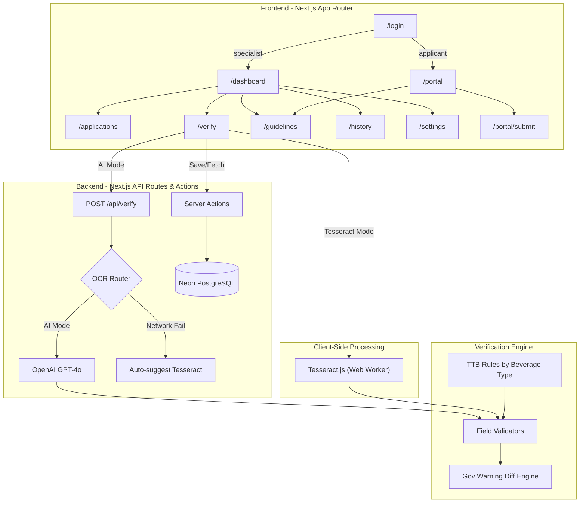

# Architecture

This document outlines the technical architecture of the AI-Powered Alcohol Label Verification App.

## System Diagram

## Technology Stack

- **Framework**: Next.js 14 (App Router)
- **Language**: TypeScript
- **Styling**: Tailwind CSS
- **UI Components**: shadcn/ui (Radix UI primitives)
- **Icons**: Lucide React
- **AI/Vision**: OpenAI API (gpt-4o)
- **Offline OCR**: Tesseract.js (WebAssembly)
- **Drag & Drop**: react-dropzone

- **Database**: Neon Serverless PostgreSQL
- **ORM**: Drizzle ORM

## Roles

The prototype has two kinds of user, both signed in by picking a profile:

1. **Specialist** — TTB staff. Sees the dashboard, the full applications queue, the verification tool, history, and settings. When creating an application they must attribute it to a company, either an existing one or a new one they add.
2. **Applicant** — a company submitting labels. Sees only its own submissions and the submit form. Submitting runs the AI checks immediately, then the application enters the queue as `awaiting_review` until a specialist signs off.

`AuthGuard` defaults to specialist-only and takes an `allow` list for pages that either role may open.

## State Management

The application uses a hybrid approach for state:

1. **`AuthContext` & `SettingsContext`**: Client-side preferences and session data persisted via `localStorage`/`sessionStorage`.
2. **`ResultsContext`**: Provides an optimistic UI layer for the verification history, which is synchronised with the remote **Neon PostgreSQL** database via Next.js **Server Actions**. This allows all agents to share a unified view of history, overrides, and notes.

## Data Flow: Verification

1. **Upload**: User drops image(s). Client-side image quality check runs (`lib/image-quality.ts`).
2. **Extraction**:
   - *AI Mode*: Image sent to `/api/verify`. Server calls OpenAI Vision API with a strict JSON schema prompt.
   - *Offline Mode*: Image processed entirely in-browser via Tesseract WebWorker.
3. **Validation**: Extracted fields are passed to the Verification Engine (`lib/verification.ts`).
4. **Rules Application**: `lib/ttb-guidelines.ts` determines which fields are required based on beverage type.
5. **Diffing**: `lib/diff.ts` runs an LCS algorithm to find exact character differences in the Government Warning.
6. **Result Generation**: A `VerificationResult` object is created and saved to the Neon database via Server Actions, broadcasting to the global `ResultsContext`.

## OCR Abstraction Layer

The verification logic is decoupled from the extraction method. Both `lib/openai.ts` and `lib/tesseract.ts` must return the same `ExtractedField[]` interface. This allows seamless switching between AI and offline modes without changing downstream verification logic.
