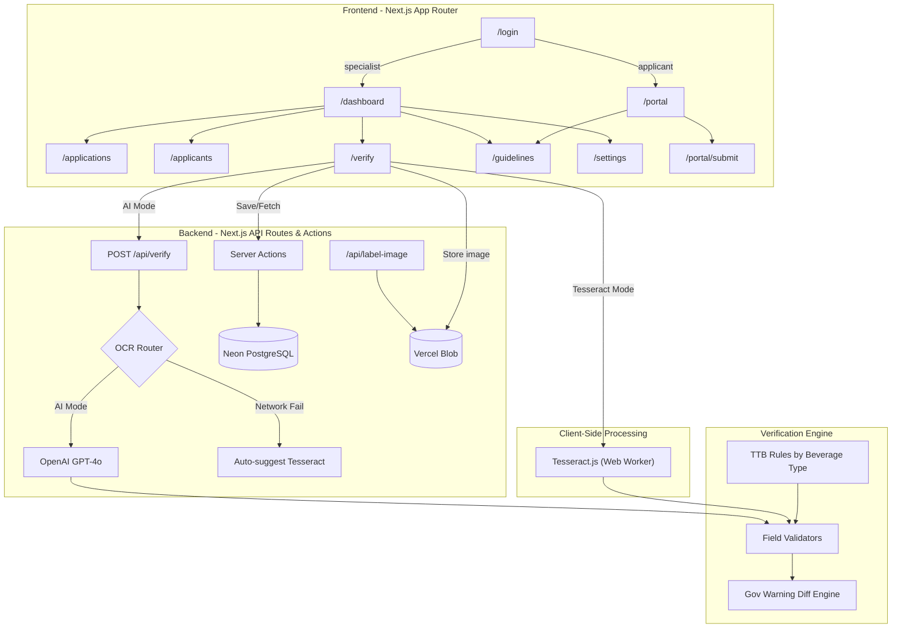

# Architecture

This document outlines the technical architecture of the AI-Powered Alcohol Label Verification App.

## System Diagram

## Technology Stack

- **Framework**: Next.js 16 (App Router), React 19
- **Language**: TypeScript
- **Styling**: Tailwind CSS v4
- **UI Components**: shadcn/ui
- **Icons**: Lucide React
- **AI/Vision**: OpenAI API (gpt-4o)
- **Offline OCR**: Tesseract.js (WebAssembly)
- **Drag & Drop**: react-dropzone
- **Database**: Neon Serverless PostgreSQL
- **ORM**: Drizzle ORM
- **Images**: Vercel Blob (private)

## Roles

The prototype has two kinds of user, both signed in by picking a profile:

1. **Specialist** — TTB staff. Sees the dashboard, applications queue, applicants directory, verification tool, guidelines, and settings. When creating an application they attribute it to a company.
2. **Applicant** — a company submitting labels. Sees only its own submissions and the submit form. Submitting runs the AI checks, then the application waits for specialist sign-off.

`AuthGuard` defaults to specialist-only and takes an `allow` list for pages that either role may open.

## State Management

1. **`AuthContext` & `SettingsContext`**: Demo session and OCR preferences in `sessionStorage` / `localStorage`.
2. **`ResultsContext`**: Optimistic UI over Neon via Server Actions so specialists share queue, overrides, and notes.

Label images are stored in Vercel Blob. Neon holds the blob URL, not the file bytes.

## Data Flow: Verification

1. **Upload**: User drops image(s). Client-side quality check runs (resolution and file size).
2. **Application data**: Specialists enter expected values by default so fields are compared, not only extracted. Skip comparison is opt-out.
3. **Extraction**:
   - *AI Mode*: Image sent to `/api/verify`. Server calls OpenAI Vision.
   - *Offline Mode*: Image processed in-browser via Tesseract.
4. **Validation**: `lib/verification.ts` plus field validators. Brand/class/producer use Levenshtein similarity after normalize. Government warning checks wording and ALL CAPS header.
5. **Batch**: Up to 4 files extract in parallel (`BATCH_CONCURRENCY`). Failures are returned per file.
6. **Persist**: Result rows go to Neon; images go to Blob.
7. **Review**: Specialist Approve is blocked only by `fail` or `warning` fields. Optional `not_checked` fields (for example country of origin on a domestic label) do not block.

## OCR Abstraction Layer

`lib/openai.ts` and `lib/tesseract.ts` both return `ExtractedField[]`, so switching engines does not change downstream verification.
